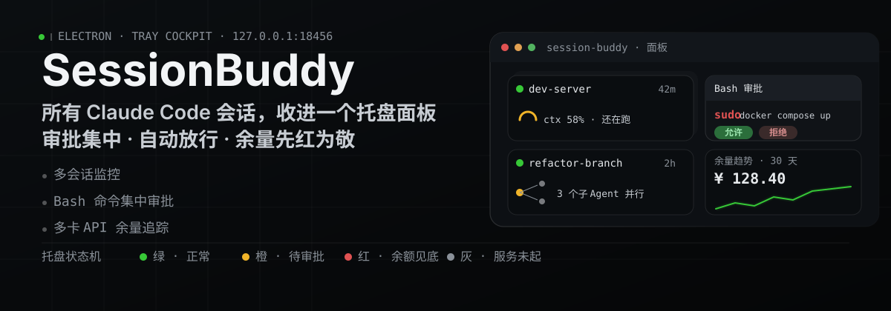
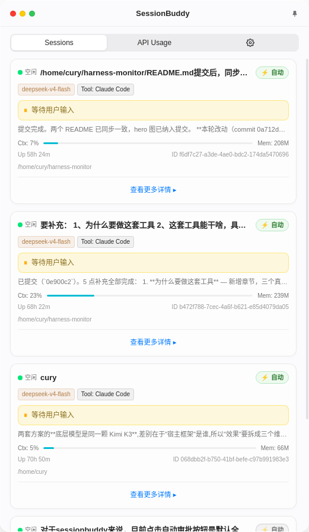
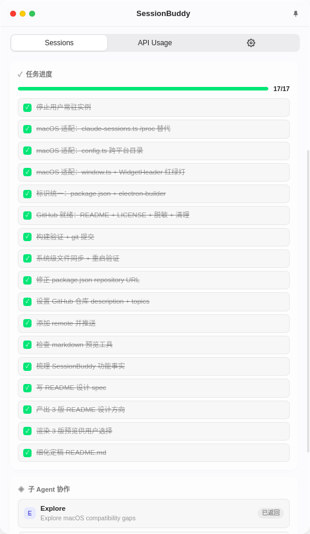
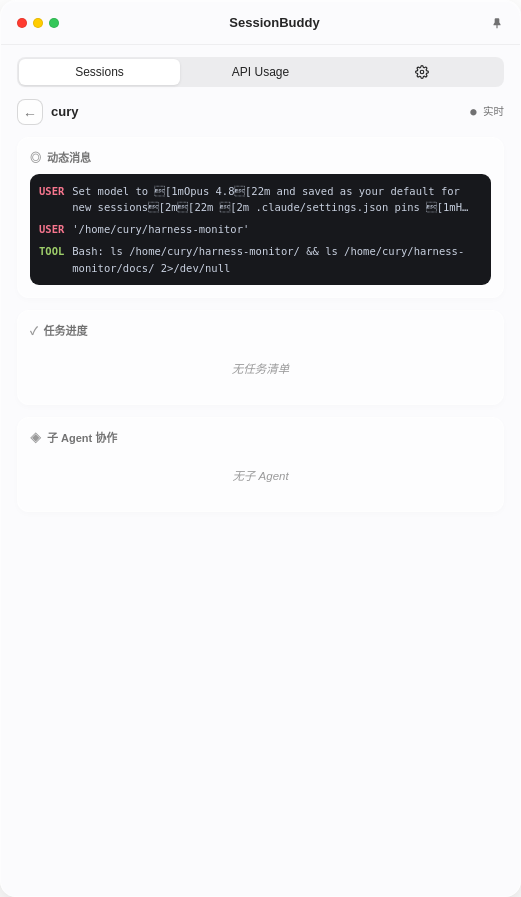
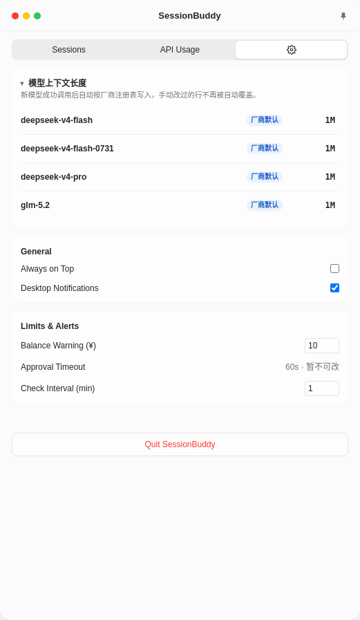
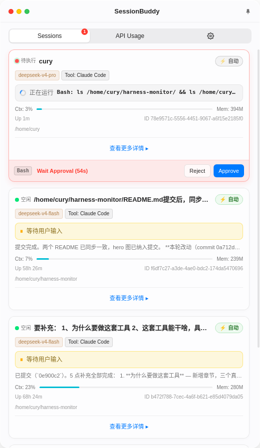

# SessionBuddy

>  一次性跑4、5个claude code终端任务，不必切来切去审批请求了

SessionBuddy就是那个最优解，它是一个常驻系统托盘的桌面小工具，所有 Claude Code 会话收进一个悬浮面板，Bash 命令审批从终端挪到弹卡集中处理，能自动放行的就自动放行。
<p align="center">
  
</p>
[](#路线图)
[](#平台支持)
[](#平台支持)
[](#许可)

## 目录

- [为什么做 SessionBuddy](#为什么做-sessionbuddy)
- [它能做什么](#它能做什么)
- [没有它 vs 有它](#没有它-vs-有它)
- [支持查询余量的 API 厂商](#支持查询余量的-api-厂商)
- [路线图](#路线图)
- [安装](#安装)
- [配置](#配置)
- [安全设计](#安全设计)
- [技术栈](#技术栈)
- [许可](#许可)

---

## 为什么做 SessionBuddy

做这套工具，是因为三个反复出现的麻烦：

1. **多会话在盲飞**。同时开四五个 `claude` 会话是常态，终端里却没有一个能扫一眼就读懂的状态：哪个在跑、哪个卡住、上下文还剩多少、子 Agent 并行了几路，全靠猜。任务清单记在脑子里，转头就忘。

2. **余额全靠肉眼查**。用 Claude Code 接第三方 API，余额散在几家云平台的网页后台，每张卡一个站点、一套登录，查一次一分钟起步。更糟的是没人会在见底前提醒你，`Insufficient Balance` 总在运行到一半才蹦出来，会话当场凉掉。

3. **命令审批打断节奏**。agent 每跑一个命令，终端就弹一次权限确认。人不在旁边的时候，十秒超时，会话干等你；闭眼回车吧，`sudo rm -rf` 那种命令又让人不太放心。

SessionBuddy 把这些收进一个悬浮在托盘的小面板：余额看一眼就知道，会话一张卡全看见，审批集中到一个弹卡，能自动放行的绝不手点。

---

## 它能做什么

### 1. 集中审批

把所有 Bash 命令审批从终端里搬到托盘，能自动放行的自动放行。

`PreToolUse` hook → `approve.sh` → 托盘弹卡：

- **自动审批开关**：对信得过的会话一键开启，常规命令直接放行，不再一次次打断你
- **危险命令集中确认**：`sudo` / `rm` / `chmod` / `dd` 依然弹出卡片并高亮，看清楚再点允许
- **镜像过滤**：终端里本就不会弹、代理静默放行的命令，这里也如实记录，不留盲区
- **桌面通知 + 超时兜底**：hook 超时链 `70000ms > curl -m 65 > server 60s 自动拒绝`，不会悬而不决
- **审批历史持久化**：批了什么、什么时候批的，存入 SQLite，事后可查

开启自动审批后，agent 跑它的，你在旁边看代码、回消息、做别的，不用守着终端一次次点「允许」。真碰到危险命令，它才把你叫回来。

比如 agent 要跑 `sudo docker compose up`，卡片弹出来，红色的 `sudo` 很清楚。看一眼没问题，点「允许」，会话继续，而不是在终端里闭眼回车。

### 2. 一个界面，管住所有会话

同时开多个 `claude` 会话干活，最怕的就是看不见。SessionBuddy 每 3 秒扫一次 `~/.claude/sessions/`，把所有会话集中在一个悬浮面板，每个会话一张卡片：

- **脉冲状态灯**：活着还是卡死，一眼区分
- **会话名称 + 运行时长 + API provider**：每个会话跑在哪个模型上，直接可见
- **上下文消耗 `ctx%`**：读 transcript 末条 usage，与终端底部指示条同源，还能聊多久一目了然
- **内存占用 + 工作目录**：占了多少内存、在哪个项目里干活
- **子 Agent 协作结构**：并行跑了几路、各在干什么
- **任务清单 + 动态消息**：当前任务进度、最近消息流，实时同步
- **每张卡片的自动审批开关**：按会话粒度决定放行策略

下班前挂四个会话收尾，回来扫一眼面板，哪个跑完了、哪个卡住了、哪个快没上下文，十秒钟全知道，不用再一个个终端窗口翻。

### 3. 余量不足，托盘先红为敬

处理完审批，SessionBuddy 顺带帮你看着 API 余量。托盘图标用颜色表示状态：

| 颜色 | 含义 |
|------|------|
| 绿 | 一切正常 |
| 橙 | 有待审批的命令 |
| 红 | 有 API 卡余额见底 |
| 灰 | 后台服务没起来 |

- 多卡余量追踪：DeepSeek、阿里云百炼已内置，`usage_sources` 可插拔
- **30 天余额趋势线**：原生 SVG 折线，hover 看数值，余额在下滑还是见底，看曲线就知道
- 低余额告警：设置阈值，红了会通知

---

## 没有它 vs 有它

| 场景 | 没有 SessionBuddy | 有 SessionBuddy |
|------|-------------------|------------------|
| 批 Bash 命令 | 终端一行小字，闭眼回车，超时即错过 | 卡片弹出 + 危险命令高亮，看清楚再点允许 |
| 频繁授权 | 每个命令都打断一次，得守着终端 | 自动审批按会话放行，安全命令不打扰，可并行做别的事 |
| 盯多个会话 | 六七个终端窗口来回切，状态全靠猜 | 一个面板全列出：状态灯、ctx%、内存、任务清单 |
| 低余额预警 | 烧穿了才知道，`Insufficient Balance` 突然报错 | 托盘变红 + 桌面通知，提前提醒 |
| 审批历史 | 批过什么全凭记忆 | SQLite 持久化，事后可查 |

---

## 支持查询余量的 API 厂商

已内置 DeepSeek（按量余额）、阿里云百炼（订阅套餐）两张卡。余量源可插拔，在 `usage_sources` 里配一个 JSON 块就能接新的厂商，无需改代码。

---

## 路线图

- Claude Code 会话监控 + 集中审批（生产可用）
- Codex 会话支持（规划中）：当前版本聚焦 Claude Code，Codex CLI 的会话监控已列入后续计划
- macOS 打包（代码已适配，待真机验证）

---

## 截图

窗口 420×650，从左到右：会话列表 / 详情页 / 审批弹卡 / 设置页。

| | |
|:---:|:---:|
| 会话列表（状态灯 + ctx% + 自动审批开关）<br> | 会话详情（动态消息 + 任务进度 + 子 Agent）<br> |
| 审批弹卡（Bash 高亮 + 超时倒计时）<br> | 设置页（模型上下文长度表 + 阈值）<br> |
| 审批卡与会话列表同框（等待审批中的真实会话）<br> | |

---

## 安装

### 平台支持

| 平台    | 状态     | 说明                                                     |
| ----- | ------ | ------------------------------------------------------ |
| Linux | ✅ 生产可用 | 主力平台，日常实测                                              |
| macOS | ⚗️ 实验性 | 已完成代码适配，**未经 macOS 真机实测**；需额外执行 `brew install jq curl` |

### 前置依赖

- **Node.js ≥ 18** + npm
- **系统构建工具** —— `better-sqlite3` 是 native 模块，prebuild 不可用时会本地编译：
  ```bash
  sudo apt install build-essential python3   # Debian / Ubuntu
  ```
- **Linux 托盘** —— GNOME 桌面需 appindicator 扩展，否则托盘图标不显示：
  ```bash
  sudo apt install gnome-shell-extension-appindicator   # Ubuntu
  ```

### 从源码运行（推荐）

```bash
git clone https://github.com/Cury1994/session-buddy.git
cd session-buddy
npm install        # 自动重建 better-sqlite3 为 Electron ABI（postinstall）
npm run dev        # 开发模式（electron-vite dev）
```

> 国内网络下载 Electron 二进制可能超时（`ETIMEDOUT`），改用镜像源再装：
>
> ```bash
> ELECTRON_MIRROR="https://registry.npmmirror.com/-/binary/electron/" npm install
> ```
>
> 本机 Electron dev GPU 可能有兼容问题（AMD 集成显卡），如遇崩溃改用构建产物：
>
> ```bash
> npm run build
> ./node_modules/.bin/electron . --disable-gpu --in-process-gpu
> ```

### 打包分发（可选）

```bash
npm run dist:linux   # deb / AppImage
npm run dist:mac     # dmg / zip（实验性）
```

产物在 `dist/` 目录。**当前未提供官方预编译 Release**（未接 CI 自动构建），需要安装包的朋友可自行打包。

---

## 配置

### 配置文件位置

Linux 用户配置路径（YAML）：

```
~/.config/harness-monitor/config.yaml
```

配置加载层级（低 → 高优先级）：内置默认 → 用户 `config.yaml`。不存在的项自动用默认值，无需写全量配置。

### 主要配置项

| 配置段 | key | 默认值 | 说明 |
|--------|-----|--------|------|
| `server` | `port` | `18456` | 本地 HTTP 服务端口（仅监听 127.0.0.1） |
| `usage_sources[]` | `id` / `name` / `kind` | DeepSeek + 百炼 | 余量源列表，`kind`：`http-json` / `bss` / `subscription` |
| `usage_sources[].auth` | `type` / `key_env` | `bearer` | `type: bearer` 时 `key_env` 指定 API key 环境变量名 |
| `usage_sources[].remaining` | `path` | — | 余额 JSON 提取路径（支持 `balance_infos[0].total_balance` 这种数组下标） |
| `detection.cc_switch` | `enabled` / `db_path` | `true` / `~/.cc-switch/cc-switch.db` | 检测本地 cc-switch 代理的模型切换 |
| `harnesses.claude-code` | `refresh_interval_sec` | `3` | Session 扫描间隔（秒） |
| `harnesses.claude-code` | `config_dirs` | `["~/.claude"]` | Claude 配置目录扫描列表 |
| `notifications` | `enabled` / `approve_timeout_sec` | `true` / `60` | 桌面通知开关 / 审批超时秒数 |
| `window` | `width` / `height` | `420` / `650` | 悬浮面板窗口尺寸 |
| `context_lengths` | — | `{}` | 模型上下文长度表（`model id → len`，空表走自动推导） |

### API Key：环境变量注入

密钥只走环境变量，**不入代码、不入配置文件**：

```bash
export DEEPSEEK_API_KEY=sk-xxx
export ALIYUN_BAILIAN_API_KEY=sk-xxx
npm run dev
```

### 审批 Hook：自动注册

应用启动时会自动把审批 hook 注册到 `~/.claude/settings.local.json`，**无需手动配置**。想手动来一份也行，示例：

```json
{
  "hooks": {
    "PreToolUse": [
      {
        "matcher": "Bash",
        "hooks": [
          { "type": "command", "command": "/path/to/session-buddy/resources/hooks/approve.sh" }
        ]
      }
    ]
  }
}
```

### 健康检查

后台服务监听 `127.0.0.1:18456`：

```bash
curl http://127.0.0.1:18456/health   # 200 = 活着
```

---

## 安全设计

一个监控 Bash 审批流的应用，安全上不能有侥幸：

- 本地 HTTP 服务只监听 `127.0.0.1`，端口不对外
- 数据不出本机：余额、会话、审批记录全部留在本地 SQLite
- Electron 渲染层走 `contextBridge` + `contextIsolation`，禁用 `nodeIntegration`
- 密钥仅存在于环境变量，代码与配置里零残留

---

## 技术栈

Electron 32 · electron-vite 2 · React 19 · TypeScript 5.9 · Tailwind 3.4 · better-sqlite3 11 · Express 4 · yaml

---

## 致谢

感谢 Claude Code 生态里每一个把终端当家的程序员。这个项目就是为你们（和我们）写的。

---

## 许可

ISC — 见 [LICENSE](LICENSE) · [GitHub 仓库](https://github.com/Cury1994/session-buddy)
